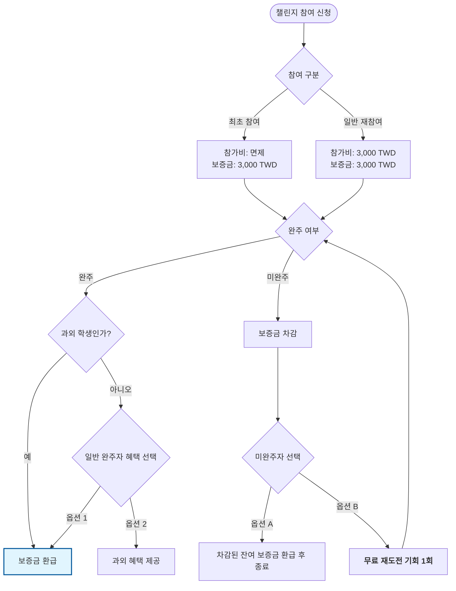

```mermaid
graph TD
    Start([챌린지 참여 신청]) --> UserType{참여 구분}

    %% 참여 조건 설정
    UserType -- 최초 참여 --> First[참가비: 면제 <br/>보증금: 3,000 TWD]
    UserType -- 일반 재참여 --> Regular[참가비: 3,000 TWD <br/>보증금: 3,000 TWD]

    First --> Result
    Regular --> Result

    Result{완주 여부}

    %% 완주 시 로직 (환급 노드 통합)
    Result -- 완주 --> StudentCheck{과외 학생인가?}
    
    StudentCheck -- 예 --> Refund[보증금 환급]
    
    StudentCheck -- 아니오 --> Benefit{일반 완주자 혜택 선택}
    Benefit -- 옵션 1 --> Refund
    Benefit -- 옵션 2 --> Reward[과외 혜택 제공]

    %% 미완주 시 로직
    Result -- 미완주 --> Penalty[보증금 차감]
    Penalty --> FailChoice{미완주자 선택}
    
    FailChoice -- 옵션 A --> ReturnMoney[차감된 잔여 보증금 환급 후 종료]
    FailChoice -- 옵션 B --> Retry[<b>무료 재도전 기회 1회</b>]
    
    %% 재도전 시 다시 완주 여부로
    Retry --> Result

    %% 스타일링
    style Refund fill:#e1f5fe,stroke:#01579b,stroke-width:2px
```
